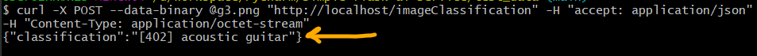

# simple-flask-ai-service
Simple example how to run AI service on flask server.

> ENVIRONMENT:
> 
> flask: 2.0.2
> 
> tensorflow: 2.3.0
> 
> AI model: squeezenet.h5 [https://github.com/oracle/graphpipe/blob/master/docs/models/squeezenet.h5](https://github.com/oracle/graphpipe/blob/master/docs/models/squeezenet.h5)
 
# How to run server

1) Install all required packages
```commandline
pip install -r requirements.txt
```

2) Run script [service-app.py](./service-app.py):
```commandline
python3 service-app.py
```
> WARNING!!!
> 
> Server has set parameter **host** to value "0.0.0.0" - it means that server is publicly available
3) Test running server - run web browser and go to http://localhost/healthcheck.

Server should response *Health Check OK*:


# How to use service *imageClassification*

You can use **cURL**

### cURL usage example
1) Go to [test_data](./test_data) folder
2) Execute this:
```commandline
curl -X POST --data-binary @g3.png "http://localhost/imageClassification" -H "accept: application/json" -H "Content-Type: application/octet-stream"
```
3) Expected json response format:
```json lines
{"classification": <label>}
```



# ENJOY
